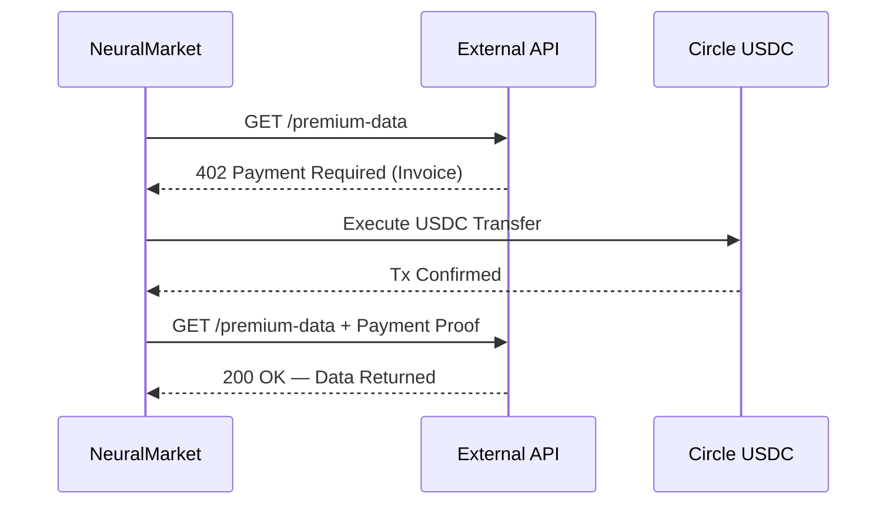

<div align="center">

# NeuralMarket

**HTTP 402 Payment Protocol Client**

[](https://python.org)
[](https://www.python-httpx.org/)
[](https://www.circle.com/)
[](LICENSE)

An intelligent HTTP client that automatically handles `402 Payment Required` responses — detecting invoices, executing Circle USDC transfers, and retrying requests with payment proof. Enables seamless machine-to-machine micro-transactions.

</div>

---

## ▸ Features

- **Automated 402 Flow** — Detects `402 Payment Required` responses, parses the invoice, executes payment, and retries the request with proof — all in a single function call.
- **Circle USDC Integration** — Fast, low-fee stablecoin transfers via the Circle Programmable Wallets API.
- **Async-First** — Built on `httpx` with full `async/await` support for high-throughput M2M payment pipelines.

---

## ▸ Payment Flow



---

## ▸ Setup

```bash
git clone https://github.com/shashankrpatil077-ctrl/NeuralMarket.git
cd NeuralMarket
pip install -r requirements.txt
```

Create a `.env` file:

```env
CIRCLE_API_KEY=your_circle_api_key
WALLET_ID=your_circle_wallet_id
```

---

## ▸ Usage

```python
import asyncio
from x402_client import x402_fetch

async def main():
    response = await x402_fetch(
        url="https://api.example.com/premium-data",
        source_wallet_id="your_wallet_id",
        max_price_usdc=0.05,
        method="GET"
    )
    print("Response:", response)

if __name__ == "__main__":
    asyncio.run(main())
```

---

## ▸ License

MIT License — see [LICENSE](LICENSE) for details.
