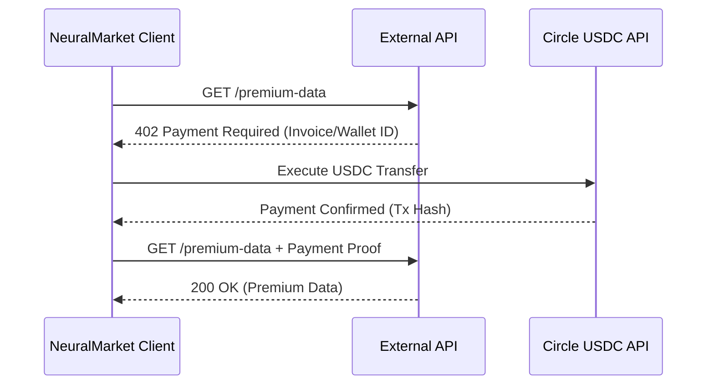

# 🧠 NeuralMarket

[](https://opensource.org/licenses/MIT)
[](https://www.python.org/downloads/)

**NeuralMarket** is an intelligent HTTP client built in Python that automatically handles the **HTTP 402 (Payment Required)** payment flow. By integrating with Circle USDC, NeuralMarket allows for seamless, programmatic machine-to-machine micro-transactions.

---

## ✨ Features

- **Automated HTTP 402 Flow:** Automatically detects `402 Payment Required` responses, parses the required invoice, and executes the payment seamlessly without breaking the application logic.
- **Circle USDC Integration:** Uses the Circle client to process fast, low-fee USDC transfers.
- **Asynchronous Execution:** Built on top of `httpx` to provide robust and fast asynchronous requests (`async/await`).

---

## 🏗️ Payment Flow



---

## ⚙️ Installation

1. **Clone the repository:**
   ```bash
   git clone https://github.com/shashankrpatil077-ctrl/NeuralMarket.git
   cd NeuralMarket
   ```

2. **Install the dependencies:**
   ```bash
   pip install -r requirements.txt
   ```

3. **Configure Environment:**
   Create a `.env` file in your root folder:
   ```env
   CIRCLE_API_KEY=your_circle_api_key
   WALLET_ID=your_circle_wallet_id
   ```

---

## 🚀 Usage

Import the `x402_fetch` function from the client to automatically handle 402 payments on any supported endpoint.

```python
import asyncio
from x402_client import x402_fetch

async def main():
    # Make a request to an endpoint that requires a payment
    response = await x402_fetch(
        url="https://api.example.com/premium-data",
        source_wallet_id="your_wallet_id",
        max_price_usdc=0.05,  # Maximum amount of USDC you are willing to spend
        method="GET"
    )
    
    print("Response Data:", response)

if __name__ == "__main__":
    asyncio.run(main())
```

---

## 📜 License
This project is licensed under the MIT License.
