<!-- Animated Header -->


<div align="center">

[](https://python.org)
[](https://www.python-httpx.org/)
[](https://www.circle.com/)
[](LICENSE)

<br/>


</div>

---

## ▸ Overview

**NeuralMarket** is an intelligent HTTP client built in Python that automatically handles the `402 Payment Required` flow. By integrating with Circle USDC, it enables seamless, programmatic machine-to-machine micro-transactions — detect the invoice, pay it, retry the request, all in one function call.

---

## ▸ Features

<table>
  <tr>
    <td width="25%" align="center"><strong>Automated 402 Flow</strong></td>
    <td>Detects <code>402 Payment Required</code> responses, parses the invoice, executes payment, and retries with proof — all transparently within a single function call.</td>
  </tr>
  <tr>
    <td align="center"><strong>Circle USDC</strong></td>
    <td>Fast, low-fee stablecoin transfers via the Circle Programmable Wallets API. No volatile crypto — payments are denominated in USD.</td>
  </tr>
  <tr>
    <td align="center"><strong>Async-First</strong></td>
    <td>Built on <code>httpx</code> with full <code>async/await</code> support for high-throughput M2M payment pipelines.</td>
  </tr>
</table>

---

## ▸ How It Works

```mermaid
%%{init: {
  'theme': 'base',
  'themeVariables': {
    'primaryColor': '#0d1117',
    'primaryTextColor': '#c9d1d9',
    'primaryBorderColor': '#30363d',
    'lineColor': '#58a6ff',
    'secondaryColor': '#161b22',
    'tertiaryColor': '#21262d',
    'actorBkg': '#1f2428',
    'actorBorder': '#58a6ff',
    'actorTextColor': '#fff',
    'noteBkg': '#003d2e',
    'noteBorder': '#2ea043',
    'noteTextColor': '#fff',
    'sequenceNumberColor': '#fff'
  }
}}%%
sequenceDiagram
    autonumber
    actor Client as 🤖 NeuralMarket Client
    participant API as 🌐 External Paid API
    participant Circle as 💸 Circle USDC Network

    Client->>API: HTTP GET /premium-data
    API-->>Client: 402 Payment Required (Invoice)
    
    rect rgb(31, 36, 40)
    Note over Client: Auto-detects invoice & USDC amount
    end
    
    Client->>Circle: Execute USDC Transfer (Wallet ➔ Wallet)
    Circle-->>Client: Tx Confirmed (TxHash Proof)
    
    Client->>API: HTTP GET /premium-data + X-Payment-Proof
    
    rect rgb(0, 61, 46)
    Note over API: Validates TxHash on-chain
    end
    
    API-->>Client: 200 OK — Data Returned
```



---

## ▸ Setup

```bash
git clone https://github.com/shashankrpatil077-ctrl/NeuralMarket.git
cd NeuralMarket
pip install -r requirements.txt
```

Create a `.env` file:

```env
CIRCLE_API_KEY=your_circle_api_key
WALLET_ID=your_circle_wallet_id
```

---

## ▸ Usage

```python
import asyncio
from x402_client import x402_fetch

async def main():
    response = await x402_fetch(
        url="https://api.example.com/premium-data",
        source_wallet_id="your_wallet_id",
        max_price_usdc=0.05,
        method="GET"
    )
    print("Response:", response)

if __name__ == "__main__":
    asyncio.run(main())
```

<details>
<summary><strong>Advanced Configuration</strong></summary>
<br/>

| Parameter | Type | Description |
|---|---|---|
| `url` | `str` | Target API endpoint |
| `source_wallet_id` | `str` | Your Circle wallet ID for payment source |
| `max_price_usdc` | `float` | Maximum USDC you're willing to spend per request |
| `method` | `str` | HTTP method — `GET`, `POST`, `PUT`, `DELETE` |
| `headers` | `dict` | Optional custom headers |
| `body` | `dict` | Optional request body for POST/PUT |
| `timeout` | `float` | Request timeout in seconds (default: 30) |

</details>

---

## ▸ License

MIT License — see [LICENSE](LICENSE) for details.

<!-- Animated Footer -->

